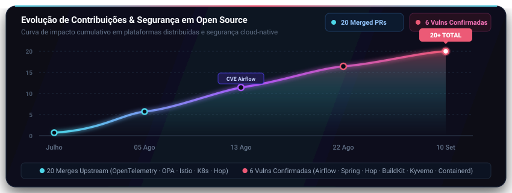

# Raphael Zanarelli

**Staff Software Engineer** · Cloud, Segurança e IA

Engenheiro de software com mais de 10 anos criando e operando aplicações empresariais críticas. Combino arquitetura cloud-native, segurança, observabilidade e liderança técnica.

## Contribuições em open source

Pull requests mergeados e vulnerabilidades confirmadas em projetos de infraestrutura e plataformas distribuídas.

**Pull requests mergeados**

- **[Spring Session](https://github.com/spring-projects/spring-session)**
  - [PR #3884](https://github.com/spring-projects/spring-session/pull/3884) — correção de nulabilidade no serializador de cookies, alinhando a API à análise estática.
- **[OpenTelemetry Collector](https://github.com/open-telemetry/opentelemetry-collector)**
  - [PR #15679](https://github.com/open-telemetry/opentelemetry-collector/pull/15679) — validação mais estrita de IDs de feature gates, rejeitando segmentos vazios causados por pontos no início, no fim ou consecutivos.
- **[Open Policy Agent (OPA)](https://github.com/open-policy-agent/opa)**
  - [PR #8962](https://github.com/open-policy-agent/opa/pull/8962) — correção de reuso de buffer na análise de segurança do AST (`reorderBodyForSafety`), impedindo que expressões de igualdade herdem variáveis não aterradas e gerem resultados vazios em compreensões ([#8302](https://github.com/open-policy-agent/opa/issues/8302)).
- **[Istio](https://github.com/istio/istio)**
  - [PR #61024](https://github.com/istio/istio/pull/61024) — correção no CNI em ambient mode impedindo a alternância indevida (flip-flop) entre backends de iptables (`legacy` vs `nft`) entre restarts consecutivos do nó.
- **[Kubernetes](https://github.com/kubernetes-sigs)**
  - [ExternalDNS · PR #6611](https://github.com/kubernetes-sigs/external-dns/pull/6611) — correção de avaliação de templates de FQDN em objetos tipados (typed sources), alinhando o comportamento ao das unstructured sources.
  - [ExternalDNS · PR #6644](https://github.com/kubernetes-sigs/external-dns/pull/6644) — reordenação da resolução de hostnames em rotas Gateway API: anotações agora são coletadas antes da avaliação do template de FQDN.
  - [ExternalDNS · PR #6694](https://github.com/kubernetes-sigs/external-dns/pull/6694) — adiciona timeout e cancelamento por contexto às chamadas da API PowerDNS.
  - [Cluster API · PR #14022](https://github.com/kubernetes-sigs/cluster-api/pull/14022) — esclarecimento na documentação sobre a semântica de full-replace em patches JSON de labels/annotations.
- **[klauspost/compress](https://github.com/klauspost/compress)**
  - [PR #1182](https://github.com/klauspost/compress/pull/1182) — correção de race condition de escrita concorrente em dicionário treinado compartilhado no encoder zstd.
  - [PR #1183](https://github.com/klauspost/compress/pull/1183) — integração do GitHub Action do OpenSSF Scorecard para auditoria contínua de segurança na supply chain.
  - [PR #1184](https://github.com/klauspost/compress/pull/1184) — prevenção de offsets negativos e corrupção de estado no algoritmo de geração de dicionários (`BuildDict`).
- **[Apache Hop](https://github.com/apache/hop)**
  - [PR #8094](https://github.com/apache/hop/pull/8094) — suporte a argumentos ocultos (Hidden Arguments) na Shell Action para mascaramento seguro (`***`) e prevenção de vazamento de credenciais em logs de execução e UI ([#4935](https://github.com/apache/hop/issues/4935)).
  - [PR #8027](https://github.com/apache/hop/pull/8027) — correção de vazamento de segredos na serialização JSON de execuções (parâmetros de pipeline não eram mascarados, como as variáveis já eram).
- **[Pika (RabbitMQ client)](https://github.com/pika/pika)**
  - [PR #1697](https://github.com/pika/pika/pull/1697) — correção de self-deadlock em `Connection.close()` quando invocado de dentro do callback de consumidor ou worker de eventos (`ThreadSafeConnection`), eliminando bloqueio mútuo no join da thread do IOLoop ([#1686](https://github.com/pika/pika/issues/1686)).
- **[Prometheus](https://github.com/prometheus/procfs)**
  - [PR #855](https://github.com/prometheus/procfs/pull/855) (procfs) — correção na documentação técnica de `parseStat` (`/proc/stat`) e otimização no parser em Go reaproveitando variável de linha (`line`).
- **[Langflow AI](https://github.com/langflow-ai/langflow)**
  - [PR #14758](https://github.com/langflow-ai/langflow/pull/14758) — suporte a parâmetro Top-K para Amazon Bedrock Converse e perfis de inferência cross-region (co-autor: commit e testes originados do PR [#14717](https://github.com/langflow-ai/langflow/pull/14717) de @zanarellidev, conforme creditado na descrição do PR mergeado).
- **[Crossplane](https://github.com/crossplane/docs)**
  - [PR #1130](https://github.com/crossplane/docs/pull/1130) (docs) — atualização e correção na documentação oficial de instalação sobre feature flags descontinuadas nas versões ativas.
- **[Dapr (Distributed Application Runtime)](https://github.com/dapr/dapr)**
  - [PR #10307](https://github.com/dapr/dapr/pull/10307) — identificação e resolução de race condition de cancel/completion em workflows em clustered deployment ([Issue #10305](https://github.com/dapr/dapr/issues/10305)).
- **[Fluent Bit](https://github.com/fluent/fluent-bit)**
  - [PR #12222](https://github.com/fluent/fluent-bit/pull/12222) — correção de parsing inseguro de MessagePack no `in_kubernetes_events` (mergeado a partir do PR original [#12187](https://github.com/fluent/fluent-bit/pull/12187), autoria preservada).
- **[Envoy Gateway](https://github.com/envoyproxy/gateway)**
  - [PR #9634](https://github.com/envoyproxy/gateway/pull/9634) — reconciliação de `ListenerSet` ao renovar o Secret TLS referenciado.
- **[Apache Kyuubi](https://github.com/apache/kyuubi)**
  - [Commit 3bc223d](https://github.com/apache/kyuubi/commit/3bc223dbec2ace1692ba22769404c9dd329981ed) — definição de regex padrão para mascaramento de dados sensíveis na configuração de redaction da API do servidor.
- **[Flux](https://github.com/fluxcd/notification-controller)**
  - [PR #1358](https://github.com/fluxcd/notification-controller/pull/1358) (notification-controller) — cobertura de teste para respostas 2xx do webhook, incluindo 204.
- **[Java Design Patterns](https://github.com/iluwatar/java-design-patterns)**
  - [PR #3583](https://github.com/iluwatar/java-design-patterns/pull/3583) — localização e tradução para português (pt-BR) dos padrões `polling-publisher`, `money` e `delegation`.

**CVEs e vulnerabilidades confirmadas**

- **[HashiCorp Consul — CVE-2026-87090](https://discuss.hashicorp.com/t/hcsec-2026-34-consul-vulnerable-to-an-authorization-bypass-in-the-catalog-node-write-path/77736)** — bypass de autorização no caminho de escrita do catálogo que pode permitir a exclusão do registro de outro nó e a tomada de sua identidade. CVSS 8,3 (Alta); publicada em 10/09/2026 e corrigida no Consul 2.0.4 e no Consul Enterprise 1.21.18 / 1.22.12 / 2.0.4. Crédito oficial como reporter.
- **[Apache Airflow — CVE-2026-68970](https://www.cve.org/CVERecord?id=CVE-2026-68970)** — vazamento de segredos em Variables do tipo lista, sem mascaramento nos logs de task. Publicada em 12/08/2026 (PYSEC-2026-3712 / BIT-airflow-2026-68970).
- **Spring AI — CVE-2026-59361** — vulnerabilidade aceita e CVE formalmente pré-atribuído pela equipe VMware / Spring Security; divulgação pública e patch em andamento (sob embargo).
- **Apache Hop** — vulnerabilidade aceita pela equipe de segurança; divulgação pública ainda pendente.
- **Docker/BuildKit** — vulnerabilidade confirmada pela equipe de segurança da Docker; divulgação pública ainda pendente.
- **[Kyverno — GHSA-5cjf-wwfg-pj4c](https://github.com/kyverno/kyverno/security/advisories/GHSA-5cjf-wwfg-pj4c)** — bypass de verificação de assinatura de imagens por aplicação incorreta do escopo de `PolicyException`; severidade alta (CVSS 7,7), corrigido no Kyverno 1.19.1. Crédito oficial como reporter.
- **Containerd** — vulnerabilidade aceita pela equipe de segurança; divulgação pública ainda pendente.

## Vamos trocar ideias?

- [Me contate no LinkedIn](https://www.linkedin.com/in/raphaelzanarelli/)
